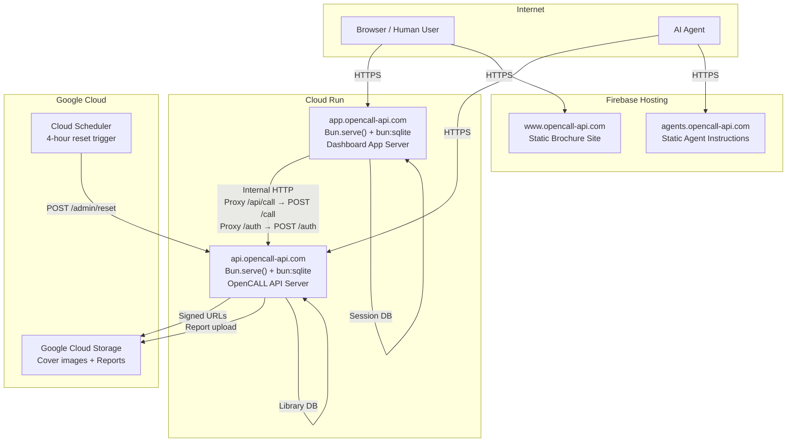
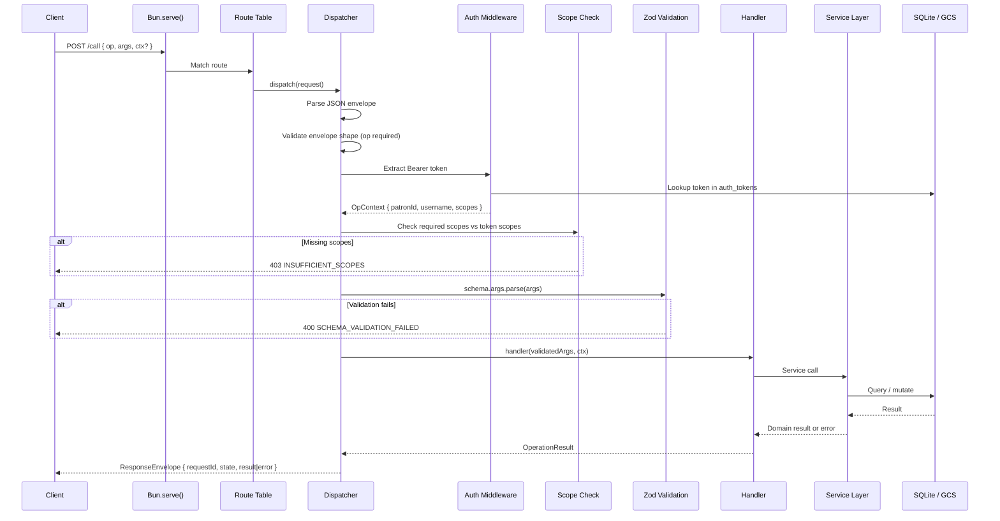
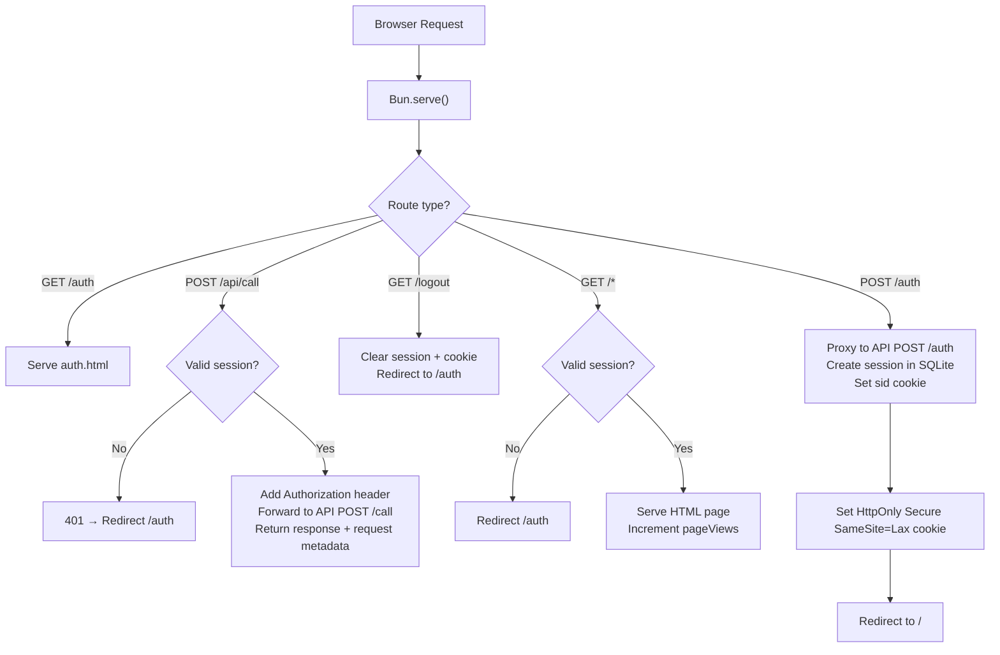
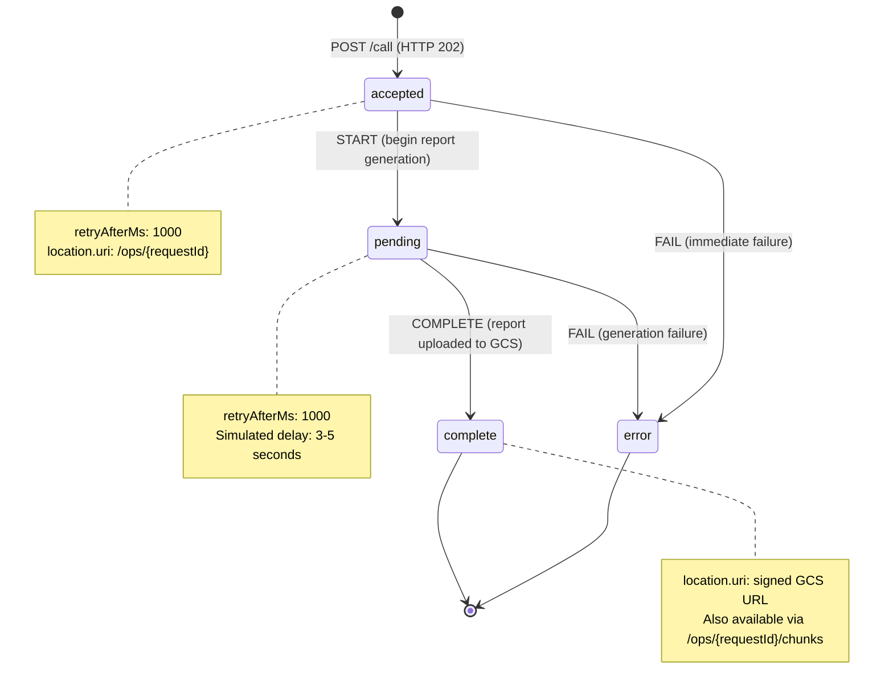

# Design Document: OpenCALL Demo Library

## Overview

This design covers a multi-subdomain demonstration of the OpenCALL specification applied to a realistic library catalog domain. The system comprises four subdomains: an API server implementing 11 operations (`api.opencall-api.com`), an interactive dashboard with split-pane envelope viewer (`app.opencall-api.com`), a static brochure site (`www.opencall-api.com`), and an agent discovery document (`agents.opencall-api.com`). The demo exercises every major protocol feature: self-description, sync/async execution, chunked retrieval, media redirects, deprecation lifecycle, scope-based access control, domain vs protocol errors, and AI agent discovery.

### Current State

- The OpenCALL specification exists as documentation with a working todo API example
- A scaffold exists for the demo project (bun init, CLAUDE.md, tsconfig.json) but no application code has been written
- The requirements document (REQ-SPEC through REQ-SEED) defines 14 requirements with full acceptance criteria
- No database schema, no operation handlers, no frontend views exist yet

### Design Goals

1. **Prove the full OpenCALL protocol** with a production-style, multi-feature API covering sync, async, chunked, redirect, deprecation, and scope enforcement patterns (REQ-SPEC)
2. **Zod as single source of truth** for runtime validation, TypeScript type inference, and JSON Schema generation for the registry (REQ-REGISTRY)
3. **Test-driven development** with bun:test integration tests covering all 11 operations, error paths, auth flows, and protocol compliance
4. **Bun-first architecture** using Bun.serve(), bun:sqlite, and Bun-native APIs throughout, with no Express, no Node.js polyfills, no external bundlers
5. **SQLite for everything** with single-file databases, zero infrastructure dependencies, and clean fit with Cloud Run scale-to-zero
6. **Atomic frontend** with server-rendered HTML, vanilla JS, and CSS, following atom/molecule/organism/template/page decomposition
7. **Zero-cost-when-idle** deployment on Cloud Run (scale to zero) and Firebase Hosting (static sites) with periodic reset via Cloud Scheduler (REQ-RESET)

### Key Design Decisions

1. **Single `/call` endpoint** — All 11 operations are invoked via `POST /call` with an `{ op, args, ctx? }` envelope. `GET /call` returns HTTP 405 with an `Allow: POST` header. No resource-oriented routes exist for operations. This is the core OpenCALL pattern: operation-first, not resource-first. The only other routes are `GET /.well-known/ops` (registry), `GET /ops/{requestId}` (polling), `GET /ops/{requestId}/chunks` (chunked retrieval), `POST /auth` and `POST /auth/agent` (authentication), and `POST /admin/reset` (database reset).

2. **Zod v4 `z.toJSONSchema()`** — Each operation module exports `args` and `result` as Zod schemas. These schemas serve triple duty: (a) runtime validation via `.parse()` in the dispatcher, (b) TypeScript type inference via `z.infer<>` for handler signatures, and (c) JSON Schema generation via `z.toJSONSchema()` for the registry response. This eliminates all schema drift between validation, types, and documentation.

3. **SQLite for everything** — Both the API server (`library.db`) and the app server (`sessions.db`) use bun:sqlite with single-file databases. No external database service is needed. SQLite is created at startup if missing, seeded from the seed script, and reset every 4 hours. This fits Cloud Run's scale-to-zero model: the database is a local file on the container, ephemeral by design, rebuilt from seed data on each deployment or reset.

4. **JSDoc annotations for registry metadata** — Operation metadata (flags, security, caching, timeouts) is declared via JSDoc tags on each operation module's named export rather than in a separate configuration file. At boot time, the registry builder scans `src/operations/*.ts`, imports the modules, reads the JSDoc blocks, and combines tag values with Zod-generated JSON Schemas to produce the full registry. This keeps metadata co-located with handler code.

5. **XState only for async ops** — The 9 synchronous operations execute inline and return HTTP 200. Only `v1:report.generate` uses an XState state machine for lifecycle management (`accepted` -> `pending` -> `complete | error`). The `v1:catalog.bulkImport` operation is declared async in the registry but always returns HTTP 403 (scope enforcement demo), so it never enters the state machine. This avoids unnecessary complexity for operations that complete within a single request cycle.

6. **Proxy pattern for app** — The browser at `app.opencall-api.com` never contacts the API server directly. All API calls go to the app server at `/api/call` (same-origin), which resolves the session cookie to a stored bearer token, forwards the request to the API server with an `Authorization` header, and returns both the API response and the original request metadata so the envelope viewer can display both sides. This keeps tokens out of the browser and avoids CORS entirely.

7. **Atomic component architecture** — The dashboard frontend uses server-rendered HTML templates with vanilla CSS and JS, organized by atomic design levels: atoms (button, input, badge), molecules (filter-bar, card, patron-badge), organisms (envelope-viewer, catalog-list), templates (split-pane-layout, auth-layout), and pages (auth, dashboard, catalog, item, account, reports). No React, no framework, no build step beyond Bun's native HTML import.

## Architecture

### System-Level Diagram



### API Request Flow



### App Request Flow



### XState Async Operation Lifecycle



## Components and Interfaces

### 1. Envelope (`call/envelope.ts`)

**Purpose**: Define and validate the canonical OpenCALL request and response envelope shapes.

**File**: `demo/api/src/call/envelope.ts`

```typescript
import { z } from "zod/v4";

/** Request envelope — the body of every POST /call */
const RequestEnvelopeSchema = z.object({
  op: z.string(),
  args: z.record(z.unknown()).optional().default({}),
  ctx: z
    .object({
      requestId: z.uuid(),
      sessionId: z.uuid().optional(),
      idempotencyKey: z.string().optional(),
    })
    .optional(),
  media: z
    .array(
      z.object({
        name: z.string(),
        mimeType: z.string(),
        ref: z.string().optional(),
        part: z.string().optional(),
      })
    )
    .optional(),
});

type RequestEnvelope = z.infer<typeof RequestEnvelopeSchema>;

/** Response envelope states */
type ResponseState = "complete" | "accepted" | "pending" | "error";

/** Canonical response envelope */
interface ResponseEnvelope {
  requestId: string;
  sessionId?: string;
  state: ResponseState;
  result?: unknown;
  error?: {
    code: string;
    message: string;
    cause?: unknown;
  };
  location?: {
    uri: string;
    auth?: {
      credentialType: string;
      credential: string;
      expiresAt?: number;
    };
  };
  retryAfterMs?: number;
  expiresAt?: number;
}
```

### 2. Dispatcher (`call/dispatcher.ts`)

**Purpose**: Parse the POST /call request body, resolve the operation from the registry, enforce auth and scopes, validate args with Zod, and route to the correct handler.

**File**: `demo/api/src/call/dispatcher.ts`

```typescript
/** Operation handler context — passed to every handler */
interface OpContext {
  requestId: string;
  sessionId?: string;
  patronId: string;
  username: string;
  scopes: string[];
}

/** Result returned by operation handlers */
type OperationResult =
  | { ok: true; result: unknown }
  | { ok: true; redirect: string; auth?: { credentialType: string; credential: string; expiresAt?: number } }
  | { ok: false; error: { code: string; message: string; cause?: unknown } }
  | { ok: true; async: true; requestId: string; location: string; retryAfterMs: number; expiresAt: number };
```

### 3. Operation Modules (`operations/*.ts`)

**Purpose**: Each file exports one operation's Zod schemas and handler function.

**File pattern**: `demo/api/src/operations/{op-name}.ts`

```typescript
import { z } from "zod/v4";
import type { OpContext, OperationResult } from "../call/dispatcher";

/** Operation module — every file in operations/ exports this shape */
interface OperationModule {
  /** Zod schema for args validation + JSON Schema generation */
  args: z.ZodType;
  /** Zod schema for result shape + JSON Schema generation */
  result: z.ZodType;
  /** The handler function called after validation passes */
  handler: (input: unknown, ctx: OpContext) => Promise<OperationResult>;
}
```

### 4. Registry (`ops/registry.ts`)

**Purpose**: Build the `GET /.well-known/ops` response at boot time by scanning operation modules, extracting JSDoc metadata, and converting Zod schemas to JSON Schema.

**File**: `demo/api/src/ops/registry.ts`

```typescript
/** A single operation descriptor in the registry response */
interface RegistryEntry {
  op: string;
  argsSchema: Record<string, unknown>; // JSON Schema from z.toJSONSchema()
  resultSchema: Record<string, unknown>; // JSON Schema from z.toJSONSchema()
  sideEffecting: boolean;
  idempotencyRequired: boolean;
  executionModel: "sync" | "async";
  maxSyncMs: number;
  ttlSeconds: number;
  authScopes: string[];
  cachingPolicy: "none" | "server" | "location";
  deprecated?: boolean;
  sunset?: string; // ISO 8601 date, e.g. "2026-06-01"
  replacement?: string; // versioned op name, e.g. "v1:catalog.list"
}

/** The full registry response shape */
interface RegistryResponse {
  callVersion: string; // "2026-02-10"
  operations: RegistryEntry[];
}
```

### 5. Error Constructors (`call/errors.ts`)

**Purpose**: Factory functions for producing canonical error envelopes for both domain and protocol errors.

**File**: `demo/api/src/call/errors.ts`

```typescript
/** Construct a domain error response (HTTP 200, state=error) */
function domainError(
  requestId: string,
  code: string,
  message: string,
  cause?: unknown
): ResponseEnvelope;

/** Construct a protocol error response (HTTP 4xx/5xx, state=error) */
function protocolError(
  code: string,
  message: string,
  httpStatus: number,
  cause?: unknown
): { status: number; body: ResponseEnvelope };
```

### 6. Auth (`auth/tokens.ts`, `auth/scopes.ts`, `auth/middleware.ts`)

**Purpose**: Token minting, scope definitions, and request authentication.

**Files**: `demo/api/src/auth/tokens.ts`, `demo/api/src/auth/scopes.ts`, `demo/api/src/auth/middleware.ts`

```typescript
/** Auth token as stored in SQLite */
interface AuthToken {
  token: string;
  tokenType: "demo" | "agent";
  username: string;
  patronId: string;
  scopes: string[]; // stored as JSON text in SQLite
  analyticsId: string | null;
  expiresAt: number; // Unix epoch seconds
  createdAt: string; // ISO 8601
}

/** All defined scopes */
type Scope =
  | "items:browse"
  | "items:read"
  | "items:write"
  | "items:manage"
  | "patron:read"
  | "patron:billing"
  | "reports:generate";

/** Scope constants and helpers */
const SCOPES: Record<Scope, string>; // description per scope
const DEFAULT_HUMAN_SCOPES: Scope[];
const AGENT_SCOPES: Scope[];
const NEVER_GRANTED: Scope[]; // ["items:manage", "patron:billing"]
```

### 7. Polling (`ops/polling.ts`) and Chunks (`ops/chunks.ts`)

**Purpose**: Handle `GET /ops/{requestId}` for async operation status and `GET /ops/{requestId}/chunks` for chunked result retrieval.

**Files**: `demo/api/src/ops/polling.ts`, `demo/api/src/ops/chunks.ts`

```typescript
/** Chunk response shape per OpenCALL specification */
interface ChunkResponse {
  checksum: string; // "sha256:{hex}"
  checksumPrevious: string | null; // null for first chunk
  offset: number;
  length: number;
  mimeType: string;
  total: number;
  cursor: string | null; // null for final chunk
  data: string; // raw text content
  state: "pending" | "complete";
}
```

### 8. App Session (`app/src/session.ts`)

**Purpose**: Server-side session management for the dashboard app using SQLite.

**File**: `demo/app/src/session.ts`

```typescript
/** Session as stored in the app's SQLite database */
interface Session {
  sid: string;
  token: string; // API bearer token
  username: string;
  cardNumber: string;
  analyticsVisitorId: string | null;
  scopes: string[]; // stored as JSON text in SQLite
  expiresAt: number; // Unix epoch seconds
  createdAt: string; // ISO 8601
}
```

### 9. Analytics (`services/analytics.ts`)

**Purpose**: Fire-and-forget visitor and agent tracking.

**File**: `demo/api/src/services/analytics.ts`

```typescript
/** Analytics visitor row */
interface AnalyticsVisitor {
  id: string;
  patronId: string | null;
  cardNumber: string | null;
  username: string | null;
  userAgent: string;
  ip: string;
  referrer: string | null;
  pageViews: number;
  apiCalls: number;
  createdAt: string; // ISO 8601
  updatedAt: string; // ISO 8601
}

/** Analytics agent row */
interface AnalyticsAgent {
  id: string;
  visitorId: string; // FK to analytics_visitors
  patronId: string;
  cardNumber: string;
  userAgent: string;
  ip: string;
  apiCalls: number;
  createdAt: string; // ISO 8601
  updatedAt: string; // ISO 8601
}
```

### 10. Lifecycle Service (`services/lifecycle.ts`)

**Purpose**: XState state machine for managing async operation lifecycle, with state persistence to SQLite.

**File**: `demo/api/src/services/lifecycle.ts`

```typescript
import { createMachine } from "xstate";

/** XState machine context */
interface LifecycleContext {
  requestId: string;
  op: string;
  args: Record<string, unknown>;
  patronId: string;
  resultLocation?: string;
  errorMessage?: string;
}

/** XState machine events */
type LifecycleEvent =
  | { type: "START" }
  | { type: "COMPLETE"; resultLocation: string }
  | { type: "FAIL"; message: string };

/** States map to ResponseEnvelope.state values */
type LifecycleState = "accepted" | "pending" | "complete" | "error";
```

## Data Models

### API Database (`api/library.db`)

8 tables across three domains: catalog/lending, auth, and analytics.

```sql
-- Catalog items sourced from Open Library + faker (REQ-SEED)
CREATE TABLE catalog_items (
    id              TEXT PRIMARY KEY,
    type            TEXT NOT NULL,           -- 'book', 'cd', 'dvd', 'boardgame'
    title           TEXT NOT NULL,
    creator         TEXT NOT NULL,           -- author, artist, publisher
    year            INTEGER,
    isbn            TEXT,
    description     TEXT,
    cover_image_key TEXT,                    -- GCS object key, nullable
    tags            TEXT DEFAULT '[]',       -- JSON array of strings
    available       INTEGER NOT NULL DEFAULT 1,  -- boolean: 1 if availableCopies > 0
    total_copies    INTEGER NOT NULL DEFAULT 1,
    available_copies INTEGER NOT NULL DEFAULT 1
);

-- Patron records (REQ-SEED, REQ-AUTH)
CREATE TABLE patrons (
    id              TEXT PRIMARY KEY,
    username        TEXT NOT NULL UNIQUE,
    name            TEXT NOT NULL,
    card_number     TEXT NOT NULL UNIQUE,    -- format: XXXX-XXXX-XX
    created_at      TEXT NOT NULL,           -- ISO 8601
    is_seed         INTEGER NOT NULL DEFAULT 0  -- 1 for seed patrons, preserved on reset
);

-- Lending history records (REQ-SEED, REQ-OPS-SYNC)
CREATE TABLE lending_history (
    id                      TEXT PRIMARY KEY,
    item_id                 TEXT NOT NULL REFERENCES catalog_items(id),
    patron_id               TEXT NOT NULL REFERENCES patrons(id),
    patron_name             TEXT NOT NULL,
    checkout_date           TEXT NOT NULL,       -- ISO 8601
    due_date                TEXT NOT NULL,        -- ISO 8601 (checkout + 14 days)
    return_date             TEXT,                 -- ISO 8601, null if still checked out
    days_late               INTEGER DEFAULT 0,
    reserved_date           TEXT,                 -- ISO 8601, null if not from reservation
    collection_delay_days   INTEGER DEFAULT 0,
    is_seed                 INTEGER NOT NULL DEFAULT 0  -- 1 for seed records, preserved on reset
);

-- Active reservations (REQ-OPS-SYNC: item.reserve)
CREATE TABLE reservations (
    id              TEXT PRIMARY KEY,
    item_id         TEXT NOT NULL REFERENCES catalog_items(id),
    patron_id       TEXT NOT NULL REFERENCES patrons(id),
    status          TEXT NOT NULL DEFAULT 'pending',  -- 'pending', 'ready', 'collected', 'cancelled'
    reserved_at     TEXT NOT NULL,           -- ISO 8601
    ready_at        TEXT,                    -- ISO 8601
    collected_at    TEXT,                    -- ISO 8601
    cancelled_at    TEXT                     -- ISO 8601
);

-- Async operation state persistence (REQ-OPS-ASYNC)
CREATE TABLE operations (
    request_id      TEXT PRIMARY KEY,
    session_id      TEXT,
    op              TEXT NOT NULL,
    args            TEXT DEFAULT '{}',       -- JSON
    state           TEXT NOT NULL DEFAULT 'accepted',  -- 'accepted', 'pending', 'complete', 'error'
    result_location TEXT,                    -- GCS signed URL or null
    error           TEXT,                    -- JSON error object or null
    created_at      TEXT NOT NULL,           -- ISO 8601
    updated_at      TEXT NOT NULL,           -- ISO 8601
    expires_at      INTEGER NOT NULL         -- Unix epoch seconds
);

-- Authentication tokens (REQ-AUTH)
CREATE TABLE auth_tokens (
    token           TEXT PRIMARY KEY,
    token_type      TEXT NOT NULL,           -- 'demo' or 'agent'
    username        TEXT NOT NULL,
    patron_id       TEXT NOT NULL,
    scopes          TEXT NOT NULL DEFAULT '[]',  -- JSON array of scope strings
    analytics_id    TEXT,                    -- FK to analytics_visitors.id or analytics_agents.id
    expires_at      INTEGER NOT NULL,        -- Unix epoch seconds
    created_at      TEXT NOT NULL            -- ISO 8601
);

-- Visitor analytics (REQ-ANALYTICS) — NOT reset
CREATE TABLE analytics_visitors (
    id              TEXT PRIMARY KEY,
    patron_id       TEXT,
    card_number     TEXT,
    username        TEXT,
    user_agent      TEXT NOT NULL,
    ip              TEXT NOT NULL,
    referrer        TEXT,
    page_views      INTEGER NOT NULL DEFAULT 0,
    api_calls       INTEGER NOT NULL DEFAULT 0,
    created_at      TEXT NOT NULL,           -- ISO 8601
    updated_at      TEXT NOT NULL            -- ISO 8601
);

-- Agent analytics (REQ-ANALYTICS) — NOT reset
CREATE TABLE analytics_agents (
    id              TEXT PRIMARY KEY,
    visitor_id      TEXT NOT NULL REFERENCES analytics_visitors(id),
    patron_id       TEXT NOT NULL,
    card_number     TEXT NOT NULL,
    user_agent      TEXT NOT NULL,
    ip              TEXT NOT NULL,
    api_calls       INTEGER NOT NULL DEFAULT 0,
    created_at      TEXT NOT NULL,           -- ISO 8601
    updated_at      TEXT NOT NULL            -- ISO 8601
);
```

### App Database (`app/sessions.db`)

1 table for server-side session management.

```sql
-- Server-side sessions (REQ-APP)
CREATE TABLE sessions (
    sid                     TEXT PRIMARY KEY,
    token                   TEXT NOT NULL,           -- API bearer token
    username                TEXT NOT NULL,
    card_number             TEXT NOT NULL,
    analytics_visitor_id    TEXT,                     -- FK to api analytics_visitors.id
    scopes                  TEXT NOT NULL DEFAULT '[]',  -- JSON array of scope strings
    expires_at              INTEGER NOT NULL,         -- Unix epoch seconds
    created_at              TEXT NOT NULL             -- ISO 8601
);
```

### Indexes

```sql
-- API database indexes
CREATE INDEX idx_lending_patron     ON lending_history(patron_id);
CREATE INDEX idx_lending_item       ON lending_history(item_id);
CREATE INDEX idx_lending_overdue    ON lending_history(patron_id, return_date) WHERE return_date IS NULL;
CREATE INDEX idx_reservations_patron ON reservations(patron_id, status);
CREATE INDEX idx_reservations_item  ON reservations(item_id, status);
CREATE INDEX idx_tokens_patron      ON auth_tokens(patron_id);
CREATE INDEX idx_tokens_expiry      ON auth_tokens(expires_at);
CREATE INDEX idx_catalog_type       ON catalog_items(type);
CREATE INDEX idx_catalog_available  ON catalog_items(available);
CREATE INDEX idx_visitors_ip_ua     ON analytics_visitors(ip, user_agent);
CREATE INDEX idx_agents_visitor     ON analytics_agents(visitor_id);
CREATE INDEX idx_agents_card        ON analytics_agents(card_number);

-- App database indexes
CREATE INDEX idx_sessions_expiry    ON sessions(expires_at);
```

## Error Handling

### Protocol Errors (HTTP 4xx/5xx)

Protocol errors indicate that the request itself is malformed, unauthenticated, unauthorized, or targets a nonexistent resource. The HTTP status code communicates the error class to infrastructure (proxies, load balancers), while the response body provides a full canonical error envelope.

| Code | HTTP Status | When | Traceability |
|------|-------------|------|--------------|
| `INVALID_ENVELOPE` | 400 | Request body is not valid JSON, or the `op` field is missing or not a string | REQ-SPEC AC 10 |
| `UNKNOWN_OPERATION` | 400 | `op` value does not match any operation in the registry | REQ-SPEC AC 10 |
| `SCHEMA_VALIDATION_FAILED` | 400 | `args` fail Zod schema validation; the `cause` field contains the Zod error details | REQ-SPEC AC 10 |
| `AUTH_REQUIRED` | 401 | No `Authorization` header, token not found in database, or token has expired | REQ-AUTH AC 17-19 |
| `INSUFFICIENT_SCOPES` | 403 | Valid token, but the granted scopes do not include all scopes required by the operation; missing scope names listed in `cause` | REQ-SCOPE AC 11-12 |
| `OPERATION_NOT_FOUND` | 404 | `GET /ops/{requestId}` or `GET /ops/{requestId}/chunks` with an unknown or expired requestId | REQ-SPEC AC 13 |
| `METHOD_NOT_ALLOWED` | 405 | `GET /call`; response includes `Allow: POST` header | REQ-SPEC AC 14 |
| `OP_REMOVED` | 410 | Calling a deprecated operation past its sunset date; `cause` includes `removedOp` and `replacement` | REQ-DEPRECATION AC 3-5 |
| `RATE_LIMITED` | 429 | Polling `GET /ops/{requestId}` more frequently than `retryAfterMs`; response includes `retryAfterMs` | REQ-SPEC AC 16 |
| `INTERNAL_ERROR` | 500 | Unexpected server failure; response includes a full error envelope with a meaningful message | REQ-SPEC AC 17 |

### Domain Errors (HTTP 200, `state=error`)

Domain errors represent business logic outcomes, not protocol failures. They are returned as HTTP 200 so that infrastructure does not interpret them as failures. The caller inspects `state=error` in the response envelope to detect a domain error.

| Code | Operations | When | Traceability |
|------|-----------|------|--------------|
| `ITEM_NOT_FOUND` | `v1:item.get`, `v1:item.getMedia`, `v1:item.reserve`, `v1:item.return` | The provided `itemId` does not match any catalog item | REQ-OPS-SYNC AC 11, 16, 21, 27 |
| `ITEM_NOT_AVAILABLE` | `v1:item.reserve` | The requested item has zero `availableCopies` | REQ-OPS-SYNC AC 28 |
| `ITEM_NOT_CHECKED_OUT` | `v1:item.return` | The authenticated patron does not have the item checked out | REQ-OPS-SYNC AC 22 |
| `OVERDUE_ITEMS_EXIST` | `v1:item.reserve` | The authenticated patron has overdue items; `cause` includes `count` and `hint` | REQ-OPS-SYNC AC 26 |
| `ALREADY_RESERVED` | `v1:item.reserve` | The patron already has an active reservation for this item | REQ-OPS-SYNC AC 29 |
| `REPORT_GENERATION_FAILED` | `v1:report.generate` | Internal failure during report generation | REQ-OPS-ASYNC AC 6 |

### Error Constructor Pattern

```typescript
import { randomUUID } from "crypto";

/** Domain error — HTTP 200, state=error */
function domainError(
  requestId: string,
  code: string,
  message: string,
  cause?: unknown
): ResponseEnvelope {
  return {
    requestId,
    state: "error",
    error: { code, message, ...(cause !== undefined && { cause }) },
  };
}

/** Protocol error — HTTP 4xx/5xx, state=error */
function protocolError(
  code: string,
  message: string,
  httpStatus: number,
  cause?: unknown
): { status: number; body: ResponseEnvelope } {
  return {
    status: httpStatus,
    body: {
      requestId: randomUUID(),
      state: "error",
      error: { code, message, ...(cause !== undefined && { cause }) },
    },
  };
}
```

## JSDoc-to-Registry Pipeline

The operation registry (`GET /.well-known/ops`) is generated at boot time, not maintained manually. This section describes the pipeline that builds it (REQ-REGISTRY).

### Boot-Time Scan Sequence

1. **Discover modules**: Glob `src/operations/*.ts` to find all operation files
2. **Import modules**: Dynamic `import()` each file; expect exports `args` (Zod schema), `result` (Zod schema), and `handler` (function)
3. **Generate JSON Schemas**: Call `z.toJSONSchema(module.args)` and `z.toJSONSchema(module.result)` to produce JSON Schema objects
4. **Parse JSDoc**: Read the source file text, extract the JSDoc comment block preceding the named export using a regex pattern, and parse individual `@tag value` lines
5. **Map tags to fields**: Convert parsed JSDoc tags into `RegistryEntry` fields
6. **Assemble registry**: Combine all entries into `{ callVersion: "2026-02-10", operations: [...] }` and cache the result in memory
7. **Compute ETag**: SHA-256 hash of the serialized registry JSON for conditional request support

### JSDoc Tag-to-Field Mapping

| JSDoc Tag | Registry Field | Type | Example |
|-----------|---------------|------|---------|
| `@op` | `op` | string | `@op v1:catalog.list` |
| `@flags sideEffecting` | `sideEffecting` | boolean | `@flags sideEffecting` |
| `@flags idempotencyRequired` | `idempotencyRequired` | boolean | `@flags idempotencyRequired` |
| `@flags deprecated` | `deprecated` | boolean | `@flags deprecated` |
| `@execution` | `executionModel` | `"sync"` or `"async"` | `@execution sync` |
| `@timeout` | `maxSyncMs` | number | `@timeout 5000` |
| `@ttl` | `ttlSeconds` | number | `@ttl 300` |
| `@security` | `authScopes` | string[] | `@security items:browse` |
| `@cache` | `cachingPolicy` | `"none"` / `"server"` / `"location"` | `@cache server` |
| `@sunset` | `sunset` | string (ISO 8601) | `@sunset 2026-06-01` |
| `@replacement` | `replacement` | string | `@replacement v1:catalog.list` |

### Example JSDoc Block

```typescript
/**
 * Browse the library catalog with filtering and pagination.
 *
 * @op v1:catalog.list
 * @execution sync
 * @timeout 5000
 * @ttl 300
 * @security items:browse
 * @cache server
 */
export const args = z.object({ /* ... */ });
export const result = z.object({ /* ... */ });
export async function handler(input: unknown, ctx: OpContext): Promise<OperationResult> { /* ... */ }
```

### Default Values

When a JSDoc tag is absent, the registry builder applies defaults:

| Field | Default |
|-------|---------|
| `sideEffecting` | `false` |
| `idempotencyRequired` | `false` |
| `executionModel` | `"sync"` |
| `maxSyncMs` | `5000` |
| `ttlSeconds` | `0` |
| `cachingPolicy` | `"none"` |
| `deprecated` | not present in output |

## Auth Flows

### Human Token Flow (`POST /auth`) (REQ-AUTH)

```
Client                          API Server                    SQLite
  │                                │                            │
  │  POST /auth                    │                            │
  │  { username?, scopes? }        │                            │
  │ ─────────────────────────────► │                            │
  │                                │  Generate username if null │
  │                                │  (adjective-animal format) │
  │                                │                            │
  │                                │  Strip never-granted scopes│
  │                                │  (items:manage,            │
  │                                │   patron:billing)          │
  │                                │                            │
  │                                │  Lookup patron by username │
  │                                │ ─────────────────────────► │
  │                                │ ◄───────────────────────── │
  │                                │                            │
  │                                │  If not found:             │
  │                                │    Create patron record    │
  │                                │    Generate card number    │
  │                                │    Seed 2-3 overdue items  │
  │                                │ ─────────────────────────► │
  │                                │ ◄───────────────────────── │
  │                                │                            │
  │                                │  Mint token: demo_{32hex}  │
  │                                │  expiresAt: now + 86400s   │
  │                                │                            │
  │                                │  INSERT auth_tokens        │
  │                                │ ─────────────────────────► │
  │                                │                            │
  │                                │  Upsert analytics_visitors │
  │                                │  (match on IP + UA)        │
  │                                │ ─────────────────────────► │
  │                                │                            │
  │  { token, username,            │                            │
  │    cardNumber, scopes,         │                            │
  │    expiresAt }                 │                            │
  │ ◄───────────────────────────── │                            │
```

### Agent Token Flow (`POST /auth/agent`) (REQ-AUTH)

```
Agent                           API Server                    SQLite
  │                                │                            │
  │  POST /auth/agent              │                            │
  │  { cardNumber }                │                            │
  │ ─────────────────────────────► │                            │
  │                                │  Validate card format      │
  │                                │  (XXXX-XXXX-XX)            │
  │                                │                            │
  │                                │  Lookup patron by card     │
  │                                │ ─────────────────────────► │
  │                                │ ◄───────────────────────── │
  │                                │                            │
  │                                │  If not found → 404        │
  │                                │  PATRON_NOT_FOUND          │
  │                                │                            │
  │                                │  Mint token: agent_{32hex} │
  │                                │  Scopes: fixed agent set   │
  │                                │                            │
  │                                │  INSERT auth_tokens        │
  │                                │ ─────────────────────────► │
  │                                │                            │
  │                                │  Lookup visitor by card    │
  │                                │  INSERT analytics_agents   │
  │                                │  (linked via visitorId)    │
  │                                │ ─────────────────────────► │
  │                                │                            │
  │  { token, username, patronId,  │                            │
  │    cardNumber, scopes,         │                            │
  │    expiresAt }                 │                            │
  │ ◄───────────────────────────── │                            │
```

### Token Validation Middleware

On every `POST /call` request:

1. Extract the `Authorization` header; expect format `Bearer {token}`
2. If the header is missing or malformed, return `AUTH_REQUIRED` (HTTP 401)
3. Look up the token in the `auth_tokens` table
4. If not found, return `AUTH_REQUIRED` (HTTP 401)
5. If `expires_at < now()`, return `AUTH_REQUIRED` (HTTP 401) with message indicating token expiry
6. Attach `OpContext { requestId, sessionId, patronId, username, scopes }` to the request for downstream use

### Scope Enforcement (REQ-SCOPE)

After authentication succeeds and before the handler is invoked:

1. The dispatcher reads the operation's `authScopes` from the cached registry
2. It compares the required scopes against the token's granted scopes
3. If any required scope is missing, return `INSUFFICIENT_SCOPES` (HTTP 403) with the missing scope names listed in the `cause` field
4. The scopes `items:manage` and `patron:billing` are never granted to any user, so `v1:catalog.bulkImport` and `v1:patron.fines` always return HTTP 403

### Scope-to-Operation Matrix

| Scope | Operations |
|-------|-----------|
| `items:browse` | `v1:catalog.list`, `v1:catalog.listLegacy` |
| `items:read` | `v1:item.get`, `v1:item.getMedia` |
| `items:write` | `v1:item.reserve`, `v1:item.return` |
| `items:manage` | `v1:catalog.bulkImport` (never granted) |
| `patron:read` | `v1:patron.get`, `v1:patron.history` |
| `patron:billing` | `v1:patron.fines` (never granted) |
| `reports:generate` | `v1:report.generate` |

## Analytics Pipeline (REQ-ANALYTICS)

All analytics operations use a fire-and-forget pattern: the analytics write is dispatched but never awaited, so it cannot slow down or fail the primary request. Analytics tables are excluded from database resets and accumulate data indefinitely.

### Event-to-Action Mapping

| Event | Action | Details |
|-------|--------|---------|
| `POST /auth` (human auth) | Upsert `analytics_visitors` | Match on `(ip, user_agent)`. If match found, update `patron_id`, `card_number`, `username`, `updated_at`. If no match, insert new row. |
| `POST /auth/agent` (agent auth) | Insert `analytics_agents` | Look up visitor by `card_number`. Insert agent row with `visitor_id` FK. If no visitor found, the agent row has a null `visitor_id`. |
| Page request (`GET /*` on app) | Increment `page_views` | Fire-and-forget `UPDATE analytics_visitors SET page_views = page_views + 1, updated_at = ? WHERE id = ?` using the visitor ID from the session. |
| `POST /call` (via app proxy) | Increment `api_calls` on visitor | Fire-and-forget `UPDATE analytics_visitors SET api_calls = api_calls + 1, updated_at = ? WHERE id = ?` |
| `POST /call` (via agent token) | Increment `api_calls` on agent | Fire-and-forget `UPDATE analytics_agents SET api_calls = api_calls + 1, updated_at = ? WHERE id = ?` |

### Privacy Constraints

- No client-side tracking scripts, cookies (beyond the functional `sid` session cookie), or pixels
- No analytics data exposed through any client-accessible API endpoint
- Tracking is purely server-side, based on IP + User-Agent for visitor deduplication

## Frontend Architecture: Atomic Design (REQ-APP)

The dashboard at `app.opencall-api.com` uses server-rendered HTML with vanilla CSS and JS, organized by atomic design levels. No React, no framework, no client-side routing. Each page is a full HTML document served by Bun.serve().

### Atoms

The smallest UI primitives. Each is a CSS class and/or HTML pattern, not a JS component.

| Atom | Description |
|------|-------------|
| `button` | Primary, secondary, danger variants; consistent padding, border-radius, hover states |
| `input` | Text input, search input; consistent sizing, focus ring |
| `badge` | Colored pill for status indicators (overdue, available, pending) |
| `code-block` | Monospace pre-formatted block with syntax highlighting and optional copy button |
| `status-indicator` | Colored dot + label for operation states (complete, pending, error, accepted) |

### Molecules

Combinations of atoms that form distinct UI units.

| Molecule | Atoms Used | Description |
|----------|-----------|-------------|
| `filter-bar` | input, button | Search field + filter dropdowns + apply button (catalog page) |
| `card` | badge, button | Content card with title, metadata, status badge, and action button |
| `patron-badge` | badge | Card number in large monospace + username below; clickable link to /account |
| `scope-checkbox-group` | input | Group of checkboxes for scope selection on the auth page |

### Organisms

Complex UI sections composed of molecules.

| Organism | Molecules Used | Description |
|----------|---------------|-------------|
| `envelope-viewer` | code-block, status-indicator | Split-pane JSON viewer showing request (method, URL, headers, body) and response (status, headers, body, elapsed ms) with syntax highlighting, collapse/expand, and copy-to-clipboard. For async ops, shows the full 202 -> pending -> complete progression. |
| `catalog-list` | card, filter-bar | Paginated, filterable catalog listing powered by `v1:catalog.list` |
| `item-detail` | card, badge, button | Full item display with cover image (303 redirect), metadata, availability, and reserve button |
| `overdue-list` | card, badge, button | List of overdue items with return buttons, powered by `v1:patron.get` |
| `report-progress` | status-indicator, badge | Async lifecycle display: accepted -> pending -> complete, with download link and chunk viewer |

### Templates

Page-level layout structures.

| Template | Description |
|----------|-------------|
| `split-pane-layout` | Left pane (human-friendly UI) + right pane (envelope viewer). Used on all authenticated pages that make API calls. Includes nav sidebar, patron badge in top-left, and responsive collapse behavior. |
| `auth-layout` | Centered card layout for the auth page. No sidebar, no envelope viewer. |

### Pages

Each page maps to a route on the app server and uses a template.

| Page | Route | Template | Operations Called |
|------|-------|----------|-----------------|
| Auth | `/auth` | auth-layout | None (form submission -> POST /auth) |
| Dashboard | `/` | split-pane-layout | `v1:patron.get` (for overdue warning banner) |
| Catalog | `/catalog` | split-pane-layout | `v1:catalog.list` |
| Item Detail | `/catalog/:id` | split-pane-layout | `v1:item.get`, `v1:item.getMedia` |
| Account | `/account` | split-pane-layout | `v1:patron.get`, `v1:patron.history`, `v1:item.return` |
| Reports | `/reports` | split-pane-layout | `v1:report.generate`, `GET /ops/{id}`, `GET /ops/{id}/chunks` |

## Testing Strategy (REQ-SPEC through REQ-SEED)

### Approach

All tests use `bun:test` and run as integration tests against a running API server. Tests start a server instance in a `beforeAll` hook and tear it down in `afterAll`. Each test file focuses on a specific protocol feature or requirement area.

### Test Helpers

| Helper | File | Purpose |
|--------|------|---------|
| `call(op, args, ctx?)` | `tests/helpers/client.ts` | Send a `POST /call` request with proper envelope structure. Returns `{ status, headers, body }`. |
| `getRegistry()` | `tests/helpers/client.ts` | Fetch `GET /.well-known/ops`. Returns parsed registry. |
| `authenticate(opts?)` | `tests/helpers/client.ts` | Call `POST /auth` and return `{ token, username, cardNumber, scopes }`. |
| `authenticateAgent(cardNumber)` | `tests/helpers/client.ts` | Call `POST /auth/agent` and return agent token response. |
| `poll(requestId, opts?)` | `tests/helpers/client.ts` | Poll `GET /ops/{requestId}` with retry logic. |
| `getChunks(requestId)` | `tests/helpers/client.ts` | Retrieve all chunks via `GET /ops/{requestId}/chunks` with cursor pagination. |
| `startServer()` / `stopServer()` | `tests/helpers/server.ts` | Lifecycle management for the test server instance. |
| `resetDb()` | `tests/helpers/server.ts` | Trigger `POST /admin/reset` between test suites if needed. |

### Test Files

| File | Requirement Coverage | Key Scenarios |
|------|---------------------|---------------|
| `call.test.ts` | REQ-SPEC, REQ-OPS-SYNC | Envelope format, all 9 sync operations, domain errors (ITEM_NOT_FOUND, OVERDUE_ITEMS_EXIST, etc.), idempotency, mutating operations (reserve, return) |
| `registry.test.ts` | REQ-REGISTRY | `GET /.well-known/ops` returns all 11 operations, correct JSON Schemas, ETag/304, deprecated operation metadata |
| `polling.test.ts` | REQ-OPS-ASYNC | `v1:report.generate` returns 202, polling transitions through accepted -> pending -> complete, error state on failure, `retryAfterMs` enforcement |
| `chunks.test.ts` | REQ-CHUNKS | Chunked retrieval with cursor pagination, SHA-256 checksum chain verification, chunk size limits, 404 for unknown requestId |
| `auth.test.ts` | REQ-AUTH, REQ-SCOPE | Human auth flow, agent auth flow, token expiry, invalid card format, patron not found, scope enforcement (403 for bulkImport and fines), never-granted scopes |
| `errors.test.ts` | REQ-SPEC, REQ-DEPRECATION | All protocol error codes (400, 401, 403, 404, 405, 410, 429), domain vs protocol error distinction, OP_REMOVED after sunset, meaningful error messages |

### Test Conventions

- Each test creates its own auth token via `authenticate()` to avoid shared state
- Tests that mutate data (reserve, return) use unique item IDs from the seed data
- Async operation tests use polling helpers with configurable timeout
- All assertions validate the full envelope shape, not just the result field

## Deployment

### Cloud Run Services

Two Cloud Run services, both using the `oven/bun:latest` base image.

#### API Service (`api.opencall-api.com`)

**Dockerfile**: `demo/api/Dockerfile`

```dockerfile
FROM oven/bun:latest AS base
WORKDIR /app
COPY package.json bun.lock* ./
RUN bun install --frozen-lockfile --production
COPY . .
EXPOSE 8080
CMD ["bun", "run", "src/server.ts"]
```

**Environment Variables**:

| Variable | Required | Description |
|----------|----------|-------------|
| `PORT` | No | Server port (default: 8080) |
| `DATABASE_PATH` | No | Path to SQLite database file (default: `./library.db`) |
| `GCS_BUCKET` | Yes | Google Cloud Storage bucket name for cover images and reports |
| `GCS_PROJECT_ID` | Yes | GCP project ID for GCS operations |
| `ADMIN_SECRET` | Yes | Shared secret for `POST /admin/reset` authentication |
| `CALL_VERSION` | No | OpenCALL version string (default: `"2026-02-10"`) |

#### App Service (`app.opencall-api.com`)

**Dockerfile**: `demo/app/Dockerfile`

```dockerfile
FROM oven/bun:latest AS base
WORKDIR /app
COPY package.json bun.lock* ./
RUN bun install --frozen-lockfile --production
COPY . .
EXPOSE 8080
CMD ["bun", "run", "src/server.ts"]
```

**Environment Variables**:

| Variable | Required | Description |
|----------|----------|-------------|
| `PORT` | No | Server port (default: 8080) |
| `API_URL` | Yes | Internal URL of the API service (e.g. `https://api.opencall-api.com`) |
| `SESSION_DB_PATH` | No | Path to SQLite session database (default: `./sessions.db`) |
| `COOKIE_SECRET` | Yes | Secret for signing session cookies |
| `AGENTS_URL` | No | URL for agent instructions (default: `https://agents.opencall-api.com`) |

### Firebase Hosting Sites

#### Brochure Site (`www.opencall-api.com`)

**Config**: `demo/www/firebase.json`

```json
{
  "hosting": {
    "site": "opencall-www",
    "public": ".",
    "ignore": ["firebase.json"],
    "headers": [
      {
        "source": "**",
        "headers": [
          { "key": "Cache-Control", "value": "public, max-age=3600" }
        ]
      }
    ]
  }
}
```

#### Agent Instructions (`agents.opencall-api.com`)

**Config**: `demo/agents/firebase.json`

```json
{
  "hosting": {
    "site": "opencall-agents",
    "public": ".",
    "ignore": ["firebase.json"],
    "headers": [
      {
        "source": "**/*.md",
        "headers": [
          { "key": "Content-Type", "value": "text/markdown; charset=utf-8" },
          { "key": "Cache-Control", "value": "public, max-age=3600" }
        ]
      }
    ]
  }
}
```

### Cloud Scheduler (REQ-RESET)

A Cloud Scheduler job triggers database reset every 4 hours:

| Property | Value |
|----------|-------|
| Schedule | `0 */4 * * *` (every 4 hours at minute 0) |
| Target | `POST https://api.opencall-api.com/admin/reset` |
| Auth Header | `Authorization: Bearer {ADMIN_SECRET}` |
| Retry | 1 retry with 60s backoff |

### Reset Behavior (REQ-RESET)

On `POST /admin/reset` (authenticated with `ADMIN_SECRET`):

**Data that resets**:
- All rows in `auth_tokens`
- All rows in `operations`
- All rows in `reservations`
- All rows in `patrons` where `is_seed = 0`
- All rows in `lending_history` where `is_seed = 0`
- Seed lending records restored to original state (return_date set back to null for overdue items)

**Data that persists**:
- All rows in `catalog_items` (immutable seed data)
- All rows in `patrons` where `is_seed = 1` (~50 seed patrons)
- All rows in `lending_history` where `is_seed = 1` (~5000 seed records, restored to seed state)
- All rows in `analytics_visitors` (never reset)
- All rows in `analytics_agents` (never reset)
- All objects in Google Cloud Storage (cover images, generated reports)

**App-side effect**: All rows in `sessions` are deleted. The next request from any existing session returns HTTP 401, triggering a redirect to `/auth` with a "The demo has been reset" banner.

## Operation Summary

For reference, the complete list of 11 operations with their key properties:

| # | Operation | Execution | Side-Effecting | Idempotent | Scope | Cache |
|---|-----------|-----------|----------------|------------|-------|-------|
| 1 | `v1:catalog.list` | sync | no | n/a | `items:browse` | server |
| 2 | `v1:catalog.listLegacy` | sync | no | n/a | `items:browse` | server |
| 3 | `v1:item.get` | sync | no | n/a | `items:read` | server |
| 4 | `v1:item.getMedia` | sync | no | n/a | `items:read` | location |
| 5 | `v1:item.reserve` | sync | yes | yes | `items:write` | none |
| 6 | `v1:item.return` | sync | yes | yes | `items:write` | none |
| 7 | `v1:patron.get` | sync | no | n/a | `patron:read` | none |
| 8 | `v1:patron.history` | sync | no | n/a | `patron:read` | none |
| 9 | `v1:patron.fines` | sync | no | n/a | `patron:billing` | none |
| 10 | `v1:catalog.bulkImport` | async | yes | yes | `items:manage` | none |
| 11 | `v1:report.generate` | async | yes | yes | `reports:generate` | none |

Note: Operations 2, 9, and 10 serve special demonstration purposes. Operation 2 (`catalog.listLegacy`) demonstrates the deprecation lifecycle (REQ-DEPRECATION). Operations 9 (`patron.fines`) and 10 (`catalog.bulkImport`) always return HTTP 403 because their required scopes (`patron:billing`, `items:manage`) are never granted, demonstrating scope enforcement (REQ-SCOPE).
